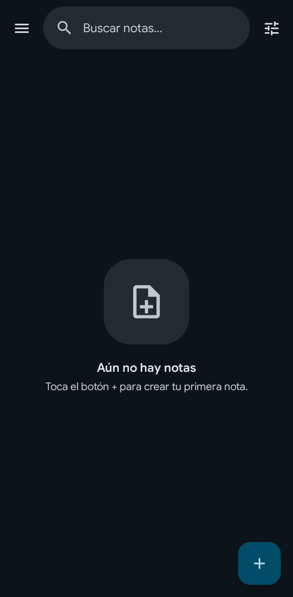

# Notar

Aplicación de notas para Android, minimalista y centrada en la privacidad. Organiza tus ideas con notas de texto enriquecido, guarda credenciales y enlaces, y sincroniza todo de forma cifrada con tu propia cuenta de Google Drive.

## Captura

## Características

- **Notas Libres**: lienzo de escritura con texto enriquecido — negrita, cursiva, subrayado, encabezados y listas con viñetas o numeración.
- **Notas de Cuenta**: guarda credenciales (servicio, correo, usuario y contraseña) con la contraseña cifrada en el dispositivo.
- **Notas de Enlace**: guarda URLs con título y descripción.
- **Vistas previas de enlaces**: vista previa automática con imágenes, iconos de sitio y soporte para páginas pesadas (p. ej. Play Store), con caché persistente.
- **Colores por nota**: distingue tus notas con una paleta de colores.
- **Ocultar/difuminar notas**: oculta el contenido de notas individuales desde la pantalla de Inicio, de forma persistente.
- **Organización avanzada**: fija, archiva, envía a la papelera, reordena arrastrando y ordena por fecha o manualmente.
- **Selección múltiple**: selecciona varias notas en Inicio, Archivo o Papelera para acciones en lote (fijar, archivar, restaurar, eliminar).
- **Búsqueda con resaltado**: encuentra notas al instante, resalta coincidencias y permite saltar entre ellas dentro de cada nota.
- **Vista de columnas**: alterna entre una y dos columnas desde la barra de búsqueda.
- **Sincronización cifrada**: respalda y restaura tus notas con Google Drive, protegidas con cifrado de extremo a extremo mediante una frase de contraseña.
- **Copia automática a Drive**: respaldo opcional con aviso accionable de cambios sin subir y botón de cuenta con estado de sincronización.
- **Seguridad**: autenticación biométrica para copiar credenciales y bloqueo de capturas de pantalla opcional.
- **Material 3 Expressive**: interfaz moderna con color dinámico (Material You) y temas claro, oscuro y automático.

## Requisitos

- Android 8.0 (API 26) o superior

## Instalación

Descarga el APK desde la sección de [Releases](../../releases) e instálalo en tu dispositivo Android.

## Tecnologías

- Kotlin
- Jetpack Compose
- Material 3 Expressive
- Hilt (Inyección de dependencias)
- Room (Base de datos local)
- Jetpack DataStore
- Google Credential Manager
- Google Drive API
- AndroidX Biometric

## Licencia

Copyright © 2026 dony-aep. Todos los derechos reservados. Consulta el archivo [LICENSE](LICENSE) para más detalles.
